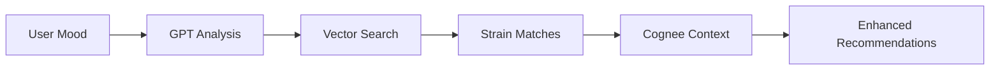
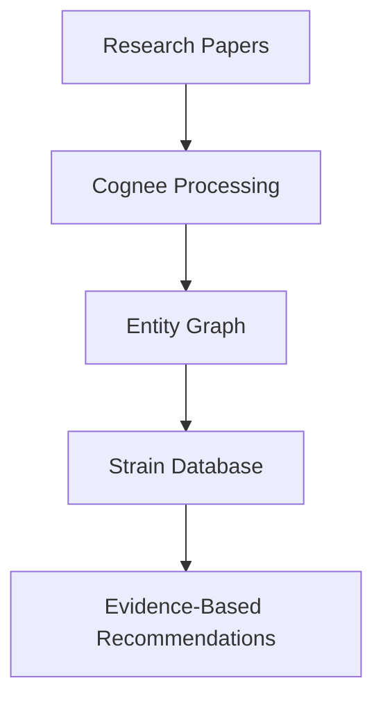

# 🚀 DOC RAG Server Backend — FastAPI + Qdrant (Amazon Export)

Build a local, privacy‑friendly RAG chatbot over your Amazon data export using FastAPI, Qdrant, and OpenAI. Ingest your CSV/JSON files, search semantically, and ask questions with context. 🧠🔎💬

Why Qdrant? 🤝
- Vector database purpose‑built for similarity search
- Open source, fast HNSW index, great local DX
- Simple API and client SDK, easy Docker setup

What you get 📦
- Ingestion of `AMAZON_DATA` into Qdrant with embeddings
- Chat endpoint that answers based on retrieved context
- Qdrant utility endpoints (list/info/count/recreate/delete collections)
- Docker Compose to run everything locally
- Scripts and curl examples to verify quickly

Quickstart (Docker Compose) 🐳
- Copy `.env.example` → `.env`.
- If you use the built‑in Qdrant service, keep `QDRANT_URL=http://qdrant:6333` and start with profile: `docker compose --profile with-qdrant up -d --build`.
- If you already have Qdrant on the host (port 6333), set `QDRANT_URL=http://host.docker.internal:6333`.
- Start and auto‑ingest: `scripts/start-compose.sh` (API is on `http://localhost:8010`).
- Or manually: `docker compose up -d --build` → `make ingest` → `make chat` (API on `http://localhost:8010`).

Quickstart (Python host) 🐍
- Create `.env` (see `.env.example`). Set `QDRANT_URL=http://localhost:6333`.
- Start Qdrant: `docker run -p 6333:6333 -v qdrant_storage:/qdrant/storage qdrant/qdrant`.
- Install deps: `pip install -r requirements.txt`.
- Run API: `uvicorn app.main:app --reload`.

Environment 🧩 (see `.env.example`)
- `QDRANT_URL`, `QDRANT_API_KEY` (optional), `QDRANT_COLLECTION` (default `amazon_export`)
- `EMBEDDING_MODEL` (default `sentence-transformers/all-MiniLM-L6-v2`)
- `OPENAI_API_KEY` and optional `OPENAI_MODEL` (e.g., `gpt-4o-mini`)
- `AMAZON_DATA_PATH` (default `AMAZON_DATA`)
- Ollama optional (leave unset if not used)

API Endpoints 🌐 (Compose default base: `http://localhost:8010`)
- `GET /health` — Health check
- `POST /ingest` — Scan `AMAZON_DATA` and upsert vectors into Qdrant
- `POST /chat` — RAG chat with top‑K Qdrant context (OpenAI or Ollama)
- `GET /search?q=...&k=5` — Debug semantic search (no LLM)

Qdrant Utility Endpoints 🧱
- `GET /qdrant/collections` — List collections (names)
- `GET /qdrant/collections/{name}` — Collection info + approximate vector count
- `GET /qdrant/count?name={optional}` — Count points in a collection (defaults to active)
- `DELETE /qdrant/collections/{name}` — Delete a collection
- `POST /qdrant/collections/{name}/recreate` — Recreate collection with current embedding dim + cosine

Test with curl 🧪 (Compose uses port 8010)
```bash
# Ingest your Amazon export
curl -X POST http://localhost:8010/ingest

# Ask a question (German example)
curl -X POST http://localhost:8010/chat \
  -H 'Content-Type: application/json' \
  -d '{"message":"Welche Bestellungen habe ich 2021 gemacht?","top_k":5}'

# Inspect nearest neighbors only
curl 'http://localhost:8010/search?q=Meine%20Bestellung%20Buch&k=5'

# Qdrant collections
curl http://localhost:8010/qdrant/collections
curl http://localhost:8010/qdrant/collections/amazon_export
curl http://localhost:8010/qdrant/count
```

How it works ⚙️
- Ingestion reads `.csv` and `.json`, flattens rows/items to compact text blocks.
- Embeds with `all-MiniLM-L6-v2` (384‑D) and upserts into Qdrant (cosine).
- Chat retrieves top‑K nearest contexts and prompts the LLM to answer only from them.

Troubleshooting 🧰
- Qdrant unreachable: check `QDRANT_URL`, container health (`docker compose ps`), or port.
- API 401 from Qdrant: set `QDRANT_API_KEY` in both Qdrant and `.env`.
- Old collection dimension mismatch: `DELETE /qdrant/collections/{name}` then re‑`/ingest`.

# RAG Backend with NestJS and Pinecone

[](https://nestjs.com/)
[](https://www.typescriptlang.org/)
[](https://www.pinecone.io/)
[](https://openai.com/)

Ein vollständiges **RAG (Retrieval-Augmented Generation)** Backend-System basierend auf **NestJS** mit **Pinecone** Vector Database und **OpenAI** Integration.

## 🚀 Features

- **📄 Document Upload & Processing**: Unterstützung für PDF, TXT, DOCX und Bilddateien (JPG, PNG, GIF, BMP, TIFF, WEBP) mit OCR
- **🔍 Semantic Search**: Vektor-basierte Dokumentensuche mit Pinecone
- **🤖 AI Question Answering**: Kontextuelle Antworten mit OpenAI GPT Modellen
- **🌿 Cannabis Strain Recommendations**: AI-powered mood-basierte Cannabis-Empfehlungen mit Knowledge Graph-ähnlicher Funktionalität
- **🧠 Cognee Knowledge Graph**: Erweiterte semantische Datenverarbeitung und Entitäts-Extraktion
- **📊 Swagger API Documentation**: Vollständige API-Dokumentation
- **⚡ Rate Limiting**: Schutz vor API-Missbrauch
- **🔒 Input Validation**: Robuste Datenvalidierung mit class-validator
- **📈 Performance Monitoring**: Logging und Metriken für alle Requests
- **🛡️ Error Handling**: Graceful Behandlung aller API-Fehler

## 📁 Projektstruktur

```
rag-backend/
├── src/
│   ├── app.module.ts          # Haupt-Anwendungsmodul
│   ├── main.ts               # Anwendungs-Einstiegspunkt
│   ├── documents/            # Document Management
│   │   ├── documents.module.ts
│   │   ├── documents.controller.ts
│   │   ├── documents.service.ts
│   │   └── dto/             # Data Transfer Objects
│   ├── embeddings/          # Text Embeddings Service
│   │   ├── embeddings.module.ts
│   │   └── embeddings.service.ts
│   ├── pinecone/           # Pinecone Vector Database
│   │   ├── pinecone.module.ts
│   │   └── pinecone.service.ts
│   ├── llm/               # Large Language Model
│   │   ├── llm.module.ts
│   │   └── llm.service.ts
│   ├── query/             # Query & RAG Functionality
│   │   ├── query.module.ts
│   │   ├── query.controller.ts
│   │   ├── query.service.ts
│   │   └── dto/
│   ├── cannabis/          # Cannabis Strain Recommendations 🌿
│   │   ├── cannabis.module.ts
│   │   ├── cannabis.controller.ts
│   │   ├── cannabis.service.ts
│   │   └── dto/           # Cannabis-specific DTOs
│   └── cognee/           # Cognee Knowledge Graph 🧠
│       ├── cognee.module.ts
│       ├── cognee.controller.ts
│       ├── cognee.service.ts
│       └── dto/           # Cognee-specific DTOs
├── package.json
├── .env.example
└── README.md
```

## 🛠️ Installation & Setup

### 1. Projekt klonen und Dependencies installieren

```bash
git clone <repository-url>
cd rag-backend
npm install
```

### 2. Environment Variables konfigurieren

Kopiere `.env.example` zu `.env` und fülle die erforderlichen Werte aus:

```bash
cp .env.example .env
```

```env
# Server Configuration
PORT=3000

# Pinecone Configuration
PINECONE_API_KEY=your_pinecone_api_key_here
PINECONE_INDEX_NAME=rag-documents

# OpenAI Configuration
OPENAI_API_KEY=your_openai_api_key_here
OPENAI_MODEL=gpt-4
EMBEDDING_MODEL=text-embedding-3-small

# Replicate Configuration
REPLICATE_API_TOKEN=your-token

# Cognee Knowledge Graph Configuration
COGNEE_API_KEY=your_cognee_api_key_here
COGNEE_BASE_URL=https://api.cognee.ai/v1

# Billing / Stripe Configuration
STRIPE_SECRET_KEY=sk_test_...
STRIPE_PRICE_ID=price_...
STRIPE_WEBHOOK_SECRET=whsec_...
FRONTEND_URL=http://localhost:5173
```

### 3. Pinecone Index erstellen

1. Gehe zu [Pinecone Console](https://app.pinecone.io/)
2. Erstelle einen neuen Index mit folgenden Einstellungen:
   - **Name**: `rag-documents` (oder wie in `.env` konfiguriert)
   - **Dimensions**: `1024` (für text-embedding-3-small)
   - **Metric**: `cosine`
   - **Pod Type**: `starter` (für kostenlose Version)

### 4. API Keys konfigurieren

#### OpenAI API Key:
1. Gehe zu [OpenAI Platform](https://platform.openai.com/api-keys)
2. Erstelle einen neuen API Key
3. Füge ihn in deine `.env` Datei ein

#### Cognee API Key:
1. Registriere dich bei [Cognee Platform](https://cognee.ai) 
2. Generiere einen API Key im Dashboard
3. Füge `COGNEE_API_KEY` in deine `.env` Datei ein
4. Optional: Konfiguriere `COGNEE_BASE_URL` falls du eine eigene Cognee-Instanz nutzt

### 5. Anwendung starten

```bash
# Development
npm run start:dev

# Production
npm run build
npm run start:prod
```

Die API läuft unter: `http://localhost:3000`
Swagger Dokumentation: `http://localhost:3000/api`

## 📚 API Endpoints

### Health Check
- `GET /api/v1` - API Status
- `GET /api/v1/version` - Version Information
- `GET /api/v1/query/health` - Service Health Check

### Billing & Tokens
- `GET /api/v1/tokens` – Aktuelles Token-Guthaben für anonymen Client (Header `X-Client-Id`)
- `POST /api/v1/checkout` – Stripe Checkout Session erstellen `{ quantity?: number }` (Header `X-Client-Id`)
- `POST /api/v1/stripe/webhook` – Stripe Fulfillment Webhook (signiert, idempotent)

Hinweise:
- Clients identifizieren sich anonym via `X-Client-Id` (8–64 Zeichen, `[A-Za-z0-9_-]`). Keine PII speichern.
- Neue Clients erhalten automatisch 5 Start-Tokens.
- Beim Checkout werden `clientId` und `quantity` in Stripe `metadata` gespeichert.
- Nach erfolgreicher Zahlung erhöht der Webhook das Guthaben idempotent.

### Image Generation
- `POST /api/v1/images/generate` – Text-/Image-to-Image via Replicate (minimax/image-01)
- `POST /api/v1/generate` – Preset-basierte Generierung via `bubbles[]` + optional `notes` + optional `image` (Header `X-Client-Id`, Tokenabzug je Bild; bei `framing=collection` Standardmenge 3)
- `GET /api/v1/images/latest-random?limit=20` – Neueste generierte Bilder (vom Image-Server), zufällig gemischt
- `GET /api/v1/images/random` – 20 zufällige generierte Bilder

### Document Management
- `POST /api/v1/documents/upload` - Dokument hochladen
- `GET /api/v1/documents` - Alle Dokumente auflisten
- `GET /api/v1/documents/stats` - Storage Statistiken
- `GET /api/v1/documents/:id` - Spezifisches Dokument
- `PUT /api/v1/documents/:id` - Dokument aktualisieren
- `DELETE /api/v1/documents/:id` - Dokument löschen

### Query & Search
- `POST /api/v1/query` - Frage stellen (mit AI Antwort)
- `POST /api/v1/query/similar` - Ähnliche Dokumente finden
- `GET /api/v1/query/explain` - Query-Prozess erklären
- `GET /api/v1/query/stats` - Query Statistiken

### Cannabis Strain Management & Recommendations 🌿
- `POST /api/v1/cannabis/strains` - Cannabis Strain hinzufügen
- `POST /api/v1/cannabis/recommendations` - Mood-basierte Strain-Empfehlungen
- `POST /api/v1/cannabis/strain-recommendations` - Stimmungsbasierte Strain-Empfehlungen mit KI-Text
- `GET /api/v1/cannabis/strains` - Alle Strains auflisten
- `DELETE /api/v1/cannabis/strains/:id` - Strain löschen
- `GET /api/v1/cannabis/health` - Cannabis Service Health Check
- `GET /api/v1/cannabis/stats` - Cannabis Knowledge Base Statistiken

## 🔧 Usage Examples

### Dokument hochladen

```bash
curl -X POST "http://localhost:3000/api/v1/documents/upload" \
  -H "Content-Type: multipart/form-data" \
  -F "file=@document.pdf" \
  -F "name=My Document" \
  -F "description=Important project document" \
  -F "tags=project,documentation"

# Oder für Bildupload mit OCR
curl -X POST "http://localhost:3000/api/v1/documents/upload" \
  -H "Content-Type: multipart/form-data" \
  -F "file=@screenshot.png" \
  -F "name=Screenshot Analysis" \
  -F "description=OCR text extraction from image" \
  -F "tags=image,ocr,analysis"
```

### Frage stellen

```bash
curl -X POST "http://localhost:3000/api/v1/query" \
  -H "Content-Type: application/json" \
  -d '{
    "question": "Was sind die Hauptthemen in den Dokumenten?",
    "maxResults": 5,
    "minScore": 0.7
  }'
```

### Image Generation

1) Einfacher Prompt (optional mit Referenzbild – wird als `subject_reference` an Replicate übergeben)

```bash
http -f POST :3000/api/v1/images/generate \
  prompt=="A close-up portrait of a leopard" \
  n:=2 \
  aspect_ratio=="3:4" \
  image@./example.jpg

# Erwartete Antwort:
# { "images": ["https://hel1.your-objectstorage.com/<bucket>/generated/<file>.jpg", "..."] }
```

2) Preset-driven Endpoint mit bubbles + notes (+ optional amount, Default 1), plus Styling-Optionen (gender, hairstyle, hairColor, framing)

```bash
http -f POST :3000/api/v1/generate \
  bubbles:='["editorial_studio","gym_fit"]' \
  notes=="slight smile, clean minimal background" \
  gender=="male" \
  hairstyleId=="curly_volume" \
  hairColorFrom=="#5A3E36" \
  hairColorTo=="#5A3E36" \
  framing=="face" \
  amount:=1 \
  image@./reference.jpg

# Antwort: { "images": ["https://...", ...], "bubbles": ["editorial_studio", "gym_fit"] }
```

3) Neueste generierte Bilder (random)

```bash
http GET :3000/api/v1/images/latest-random limit==24

# Antwort: { "images": ["https://hel1.your-objectstorage.com/<bucket>/generated/<file>.jpg", ...] }
```

4) 20 zufällige generierte Bilder

```bash
http GET :3000/api/v1/images/random

# Antwort: { "images": ["https://hel1.your-objectstorage.com/<bucket>/generated/<file>.jpg", ...] }
```

TypeScript/JS Client-Beispiel

```ts
import type { Bubble } from './types';

export type GenerateRequest = {
  bubbles: string[];
  notes?: string;
  image?: File | Blob;
};

export interface GenerateResponse { images: string[] }
type ApiError = { error?: string };

export async function generateImages(baseUrl: string, request: GenerateRequest): Promise<GenerateResponse> {
  const formData = new FormData();
  if (request.image) {
    formData.append('image', request.image);
  }
  if (request.notes) {
    formData.append('notes', request.notes);
  }
  formData.append('bubbles', JSON.stringify(request.bubbles));

  const response = await fetch(`${baseUrl}/generate`, { method: 'POST', body: formData });
  if (!response.ok) {
    const error: ApiError = await response.json().catch(() => ({} as ApiError));
    throw new Error(error?.error || 'Generation failed');
  }
  return response.json();
}

// Tipp: baseUrl sollte auf die API-Präfix-Route zeigen, z. B.:
// const baseUrl = 'http://localhost:3000/api/v1';
```

### Ähnliche Dokumente finden

```bash
curl -X POST "http://localhost:3000/api/v1/query/similar" \
  -H "Content-Type: application/json" \
  -d '{
    "text": "machine learning algorithms",
    "limit": 10,
    "minScore": 0.6
  }'
```

### Cannabis Strain hinzufügen 🌿

```bash
curl -X POST "http://localhost:3000/api/v1/cannabis/strains" \
  -H "Content-Type: application/json" \
  -d '{
    "name": "Blue Dream",
    "type": "hybrid",
    "description": "A balanced hybrid strain known for its sweet berry aroma and relaxing effects",
    "thc": 18.5,
    "cbd": 0.1,
    "effects": ["happy", "relaxed", "euphoric", "creative"],
    "flavors": ["berry", "sweet", "vanilla"],
    "medical": ["stress", "depression", "pain"],
    "terpenes": [
      {"name": "Myrcene", "percentage": 0.8},
      {"name": "Limonene", "percentage": 0.6}
    ],
    "genetics": "Blueberry x Haze",
    "breeder": "DJ Short",
    "rating": 4.2
  }'
```

### Mood-basierte Strain-Empfehlungen

```bash
curl -X POST "http://localhost:3000/api/v1/cannabis/recommendations" \
  -H "Content-Type: application/json" \
  -d '{
    "moodDescription": "I feel stressed after a long day at work and want to relax while watching Netflix",
    "timeOfDay": "evening",
    "activityContext": "relaxation",
    "targetSymptoms": ["stress", "anxiety"],
    "stressLevel": 8,
    "energyLevel": 3,
    "maxResults": 5,
    "minScore": 0.7
  }'
```

### Alle Cannabis Strains auflisten

```bash
curl -X GET "http://localhost:3000/api/v1/cannabis/strains" \
  -H "Content-Type: application/json"
```

### Cannabis Service Health Check

```bash
curl -X GET "http://localhost:3000/api/v1/cannabis/health" \
  -H "Content-Type: application/json"
```

### Cannabis Strain löschen

```bash
curl -X DELETE "http://localhost:3000/api/v1/cannabis/strains/strain-uuid-123" \
  -H "Content-Type: application/json"
```

### Cannabis Knowledge Base Statistiken

```bash
curl -X GET "http://localhost:3000/api/v1/cannabis/stats" \
  -H "Content-Type: application/json"
```

### Stimmungsbasierte Strain-Empfehlungen mit KI-Text 🌿🤖

```bash
curl -X POST "http://localhost:3000/api/v1/cannabis/strain-recommendations" \
  -H "Content-Type: application/json" \
  -d '{
    "moodDescription": "Ich fühle mich gestresst nach der Arbeit und möchte entspannen",
    "maxResults": 5
  }'
```

**Weitere Beispiele für Stimmungsbeschreibungen:**
```bash
# Kreative Session
curl -X POST "http://localhost:3000/api/v1/cannabis/strain-recommendations" \
  -H "Content-Type: application/json" \
  -d '{"moodDescription": "Ich möchte kreativ sein und an meinem Kunstprojekt arbeiten"}'

# Entspannung am Abend
curl -X POST "http://localhost:3000/api/v1/cannabis/strain-recommendations" \
  -H "Content-Type: application/json" \
  -d '{"moodDescription": "Müde vom Tag, brauche Entspannung für Netflix & Chill"}'

# Energie für den Tag
curl -X POST "http://localhost:3000/api/v1/cannabis/strain-recommendations" \
  -H "Content-Type: application/json" \
  -d '{"moodDescription": "Morgens, brauche Energie und Fokus für die Arbeit"}'
```

**Antwort-Beispiel:**
```json
{
  "moodAnalysis": {
    "detectedMood": "gestresst, entspannung suchend",
    "recommendedEffects": ["relaxed", "calm", "stress-relief"],
    "timeContext": "nach der Arbeit",
    "intensity": "medium",
    "strainType": "indica",
    "keywords": ["stress-relief", "relaxation"]
  },
  "strains": [
    {
      "id": "strain-uuid-123",
      "name": "Blue Dream",
      "type": "hybrid",
      "description": "A balanced hybrid strain known for its sweet berry aroma...",
      "thc": 18.5,
      "cbd": 0.2,
      "effects": ["happy", "relaxed", "creative"],
      "flavors": ["berry", "sweet", "vanilla"],
      "medical": ["stress", "depression", "pain"],
      "terpenes": [
        {"name": "Myrcene", "percentage": 0.8},
        {"name": "Limonene", "percentage": 0.6}
      ],
      "genetics": "Blueberry x Haze",
      "rating": 4.2,
      "recommendationText": "Für deine stressige Situation nach der Arbeit ist Blue Dream genau das Richtige. Die ausgewogene Hybrid-Genetik hilft dir dabei, vom Arbeitsstress abzuschalten und gleichzeitig entspannt aber nicht müde zu werden. Mit seinen entspannenden Effekten ist es perfekt für dein After-Work-Ritual.",
      "similarity": 0.89,
      "matchReason": "Perfekt für gestresst, entspannung suchend - bietet relaxed, calm",
      "createdAt": "2025-09-15T10:00:00.000Z"
    }
  ],
  "totalResults": 5,
  "processingTime": 1250,
  "generatedAt": "2025-09-15T10:30:00.000Z"
}
```

---

## 🧠 Cognee Knowledge Graph API

Das Cognee-Modul bietet erweiterte Knowledge-Graph-Funktionalitäten zur semantischen Datenverarbeitung und -analyse.

### Textdaten zu Cognee hochladen

```bash
curl -X POST "http://localhost:3000/api/v1/cognee/upload/data" \
  -H "Content-Type: application/json" \
  -d '{
    "content": "Cannabis ist eine vielseitige Pflanze mit verschiedenen medizinischen Anwendungen. THC und CBD sind die wichtigsten Cannabinoide.",
    "dataType": "text",
    "title": "Cannabis Grundlagen",
    "processingMode": "full",
    "metadata": {
      "source": "research_document",
      "tags": ["cannabis", "medizin", "forschung"],
      "author": "Dr. Cannabis",
      "createdAt": "2025-09-11"
    },
    "createRelationships": true,
    "extractEntities": true
  }'
```

### Textdatei zu Cognee hochladen

```bash
curl -X POST "http://localhost:3000/api/v1/cognee/upload/file" \
  -F "file=@cannabis_research.txt" \
  -F "author=Prof. Dr. Cannabis Forscher" \
  -F "tags=medizin,cannabis,forschung,wissenschaft"
```

### Cognee Knowledge Graph abfragen

```bash
curl -X POST "http://localhost:3000/api/v1/cognee/query" \
  -H "Content-Type: application/json" \
  -d '{
    "query": "Finde alle Informationen über THC und CBD Wirkmechanismen",
    "limit": 10
  }'
```

### Entitäten im Knowledge Graph suchen

```bash
curl -X GET "http://localhost:3000/api/v1/cognee/search?term=cannabis&type=Substance&limit=20" \
  -H "Content-Type: application/json"
```

### Cognee Service Health Check

```bash
curl -X GET "http://localhost:3000/api/v1/cognee/health" \
  -H "Content-Type: application/json"
```

### Cognee Knowledge Graph Statistiken

```bash
curl -X GET "http://localhost:3000/api/v1/cognee/stats" \
  -H "Content-Type: application/json"
```

### Unterstützte Dateiformate für Upload:

- **Text-Dateien:** `.txt`, `.csv`, `.json`, `.md`, `.rtf`
- **Maximale Dateigröße:** 10MB
- **Verarbeitung:** Automatische Entitäts-Extraktion und Relationship-Mapping

---

## 🌿🧠 Cannabis & Cognee Integration: Wie funktioniert das zusammen?

Diese Anwendung kombiniert **Cannabis-Empfehlungssysteme** mit **Cognee Knowledge Graph-Technologie** für eine umfassende, semantische Datenanalyse. Hier ist eine detaillierte Erklärung der Architektur:

### 🔄 **Daten-Pipeline & Workflow:**

#### **1. Cannabis Strain Management (Pinecone + OpenAI)**
```
Cannabis Strain → Text Embedding → Pinecone Vektor DB → AI Mood Analysis → Recommendation
```

**Funktionsweise:**
- Cannabis-Strains werden mit detaillierten Informationen (THC/CBD, Terpene, Effekte) gespeichert
- Jeder Strain wird in einen **hochdimensionalen Vektor** umgewandelt (OpenAI Embeddings)
- Nutzer-Stimmung wird von **GPT-4** analysiert und in semantischen Text konvertiert
- **Vektor-Ähnlichkeitssuche** findet passende Strains basierend auf Mood-Profil

#### **2. Cognee Knowledge Graph (Advanced Semantics)**
```
Research Data → Entity Extraction → Relationship Mapping → Knowledge Graph → Query Interface
```

**Funktionsweise:**
- Forschungsdaten und Texte werden hochgeladen
- **Entitäts-Extraktion** identifiziert Cannabis-relevante Begriffe (THC, CBD, Terpene, Symptome)
- **Beziehungs-Mapping** erstellt semantische Verbindungen zwischen Entitäten
- **Natürlichsprachliche Queries** durchsuchen den Knowledge Graph

### 🔗 **Synergie-Effekte:**

#### **A) Enhanced Strain Discovery**


- Cannabis-System findet Basis-Matches
- Cognee liefert zusätzlichen **wissenschaftlichen Kontext**
- Kombinierte Empfehlungen sind **präziser und informierter**

#### **B) Research-Driven Recommendations**


- Wissenschaftliche Studien werden in Cognee verarbeitet
- Extrahierte Erkenntnisse **validieren Cannabis-Empfehlungen**
- Nutzer erhalten **evidenz-basierte Begründungen**

### 🎯 **Praktische Anwendungsfälle:**

#### **Szenario 1: Mood-basierte Empfehlung mit Wissenschaftskontext**
```bash
# 1. Strain-Empfehlung basierend auf Stimmung
curl -X POST "/api/v1/cannabis/recommendations" -d '{
  "moodDescription": "Stressed from work, need relaxation",
  "timeOfDay": "evening"
}'

# 2. Zusätzlicher Kontext aus Cognee Knowledge Graph
curl -X POST "/api/v1/cognee/query" -d '{
  "query": "Stress-relief mechanisms of recommended terpenes"
}'
```

#### **Szenario 2: Forschung-zu-Praxis Pipeline**
```bash
# 1. Neue Forschung zu Cognee hinzufügen
curl -X POST "/api/v1/cognee/upload/file" \
  -F "file=@new_cannabis_study.txt" \
  -F "tags=research,clinical-trial"

# 2. Erkenntnisse in Cannabis-Empfehlungen integrieren
curl -X POST "/api/v1/cannabis/recommendations" -d '{
  "moodDescription": "Looking for evidence-based anxiety relief"
}'
```

### 🏗️ **Technische Architektur:**

#### **Datenfluss:**
1. **Input Layer**: User Mood/Research Data
2. **Processing Layer**: GPT Analysis/Cognee Entity Extraction  
3. **Storage Layer**: Pinecone Vectors/Knowledge Graph
4. **Retrieval Layer**: Semantic Search/Graph Queries
5. **Output Layer**: Enhanced Recommendations/Context

#### **Shared Components:**
- **OpenAI GPT-4**: Mood Analysis + Entity Reasoning
- **Vector Embeddings**: Semantic Similarity für beide Module
- **NestJS Framework**: Unified API Architecture
- **TypeScript DTOs**: Type-safe Data Flow

### 🔬 **Wissenschaftlicher Mehrwert:**

#### **Evidence-Based Cannabis Recommendations:**
```typescript
interface EnhancedRecommendation {
  strain: CannabiStrain;
  moodMatch: number;
  scientificEvidence: {
    studies: ResearchPaper[];
    mechanisms: string[];
    contraindications: string[];
  };
  cogneeInsights: {
    relatedEntities: Entity[];
    supportingRelationships: Relationship[];
  };
}
```

#### **Dynamisches Lernen:**
- Neue Forschung **aktualisiert automatisch** Empfehlungslogik
- Knowledge Graph **erweitert sich kontinuierlich**
- **Feedback-Loops** verbessern Accuracy über Zeit

### 🚀 **Erweiterte Use Cases:**

1. **Medical Professional Dashboard**: Ärzte können evidenz-basierte Cannabis-Verschreibungen machen
2. **Research Platform**: Wissenschaftler können neue Erkenntnisse mit existierenden Strain-Daten verknüpfen  
3. **Patient Journey Tracking**: Langzeit-Outcomes mit wissenschaftlichen Erkenntnissen korrelieren
4. **Regulatory Compliance**: Automatische Generierung von Sicherheits- und Wirksamkeitsberichten

### 💡 **Warum diese Kombination?**

**Cannabis allein**: Gute Empfehlungen basierend auf Nutzer-Präferenzen
**Cognee allein**: Mächtige semantische Datenanalyse ohne Domänen-Fokus
**Cannabis + Cognee**: **Wissenschaftlich validierte, personalisierte Cannabis-Medizin**

Diese Integration macht aus subjektiven Empfehlungen **objektive, datengetriebene Entscheidungshilfen** für medizinisches Cannabis.

---

## 🧪 Testing

```bash
# Unit Tests
npm run test

# E2E Tests
npm run test:e2e

# Test Coverage
npm run test:cov
```

## 📝 Development

### Code Formatting & Linting

```bash
# Format code
npm run format

# Lint code
npm run lint

# Fix linting issues
npm run lint:fix
```

### Debugging

```bash
# Start in debug mode
npm run start:debug
```

Debug-Port: `9229`

## 🏗️ Architecture

### Text Processing Pipeline

1. **File Upload**: PDF/TXT/DOCX/Bilddateien werden akzeptiert
2. **Text Extraction**: 
   - PDF: Direkter Text-Export mit pdf-parse
   - DOCX: Text-Extraktion mit mammoth
   - Bilder: OCR mit Tesseract.js (Deutsch + Englisch)
   - Bildvorverarbeitung mit Sharp für bessere OCR-Ergebnisse
3. **Text Chunking**: Dokumente werden in überlappende Chunks aufgeteilt (700 Zeichen, 100 Zeichen Überlappung)
4. **Embeddings Generation**: Jeder Chunk wird mit OpenAI's text-embedding-ada-002 in Vektoren umgewandelt
5. **Vector Storage**: Vektoren werden in Pinecone gespeichert mit Metadaten

### Query Processing Pipeline

1. **Question Embedding**: Frage wird in Vektor umgewandelt
2. **Similarity Search**: Pinecone findet ähnlichste Dokument-Chunks
3. **Context Filtering**: Chunks werden nach Relevanz-Score gefiltert
4. **Response Generation**: OpenAI GPT generiert Antwort basierend auf Kontext
5. **Response Enrichment**: Antwort wird mit Quellen und Confidence-Score angereichert

## 🔒 Security Considerations

- **Rate Limiting**: Automatischer Schutz vor API-Missbrauch
- **Input Validation**: Alle Eingaben werden validiert
- **File Upload Restrictions**: Nur erlaubte Dateitypen und Größenbeschränkungen
- **Environment Variables**: Sensible Daten in .env Dateien
- **CORS**: Konfigurierbare Cross-Origin Requests

## 📊 Monitoring & Logging

Das System bietet umfassendes Logging für:
- API Request/Response Zeiten
- Token Usage Tracking
- Embedding Generation Performance
- Pinecone Query Performance
- Error Rates und Types

## 🚀 Production Deployment

### Docker Deployment

```bash
# Build Docker Image
docker build -t rag-backend .

# Run Container
docker run -p 3000:3000 --env-file .env rag-backend
```

### Environment Variables für Production

```env
NODE_ENV=production
PORT=3000

# Security
THROTTLE_SHORT_LIMIT=5
THROTTLE_MEDIUM_LIMIT=50
THROTTLE_LONG_LIMIT=500

# Logging
LOG_LEVEL=info
```

## 📈 Performance Optimization

- **Batch Processing**: Embeddings werden in Batches verarbeitet
- **Connection Pooling**: Effiziente Pinecone Verbindungen
- **Caching**: Response Caching für häufige Queries
- **Chunking Strategy**: Optimierte Chunk-Größen für bessere Retrieval

## 🔍 Troubleshooting

### Häufige Probleme

1. **Pinecone Connection Failed**
   - Überprüfe API Key und Index Name
   - Stelle sicher, dass Index mit 1536 Dimensionen erstellt wurde

2. **OpenAI API Errors**
   - Überprüfe API Key Gültigkeit
   - Überprüfe Account Credits/Limits

3. **File Upload Issues**
   - Überprüfe Dateigröße (max 10MB)
   - Unterstützte Formate: PDF, TXT, DOCX, JPG, PNG, GIF, BMP, TIFF, WEBP

4. **OCR Processing Issues**
   - OCR kann bei schlechter Bildqualität fehlschlagen
   - Für bessere Ergebnisse: Hoher Kontrast, klare Schrift verwenden
   - Tesseract unterstützt Deutsch und Englisch

5. **Memory Issues**
   - Reduziere Batch-Größen für Embeddings
   - Überwache Heap Usage bei großen Dokumenten

## 🤝 Contributing

1. Fork das Repository
2. Erstelle einen Feature Branch (`git checkout -b feature/amazing-feature`)
3. Commite deine Changes (`git commit -m 'Add amazing feature'`)
4. Push zum Branch (`git push origin feature/amazing-feature`)
5. Öffne eine Pull Request

## 📄 License

Dieses Projekt steht unter der [MIT License](LICENSE).

## 🙋‍♂️ Support

Bei Fragen oder Problemen:
- Erstelle ein [Issue](https://github.com/your-repo/issues)
- Kontaktiere: your-email@example.com

---

**Erstellt mit ❤️ using NestJS, Pinecone, and OpenAI**
